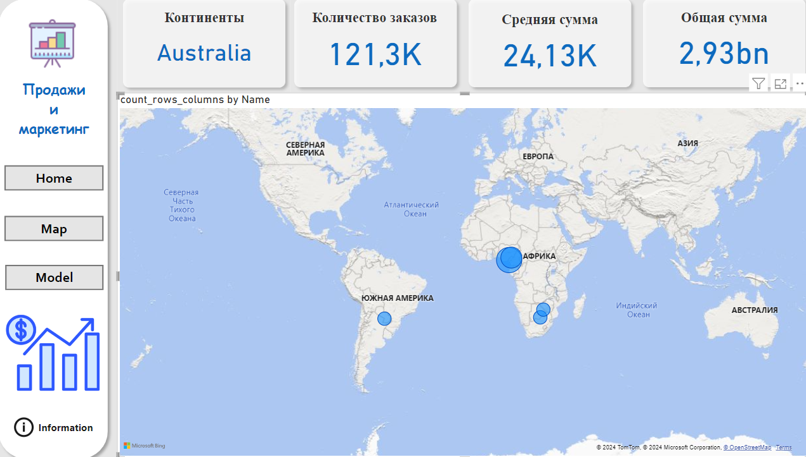

📊 Dashboard tafsilotlari
Ushbu dashboardda turli xil savdo ko'rsatkichlari va o'lchovlar namoyish etilgan:

Umumiy buyurtma summasi: 2,60 billion
Soliq miqdori: 251,8 million
Yetkazib berish narxi: 78,7 million
Jami miqdor: 2,93 billion

Vizualizatsiyalar:
Buyurtma miqdori bo'yicha ranglar: Buyurtmalar rangga qarab guruhlangan va ular hajmi diagrammada ko'rsatilgan.
Oylik buyurtmalar: Buyurtmalar oylar bo'yicha taqsimlanib, grafik orqali ifodalangan.
Buyurtmalar mamlakatlar bo'yicha: AQSh, Kanada, Avstraliya kabi davlatlar bo'yicha buyurtmalar taqsimoti.
Online va Offline buyurtmalar: Online va Offline buyurtmalarning umumiy soni va ulushi.

https://github.com/user-attachments/assets/6cb90e54-7cae-4cc3-b30e-feb284488fda

