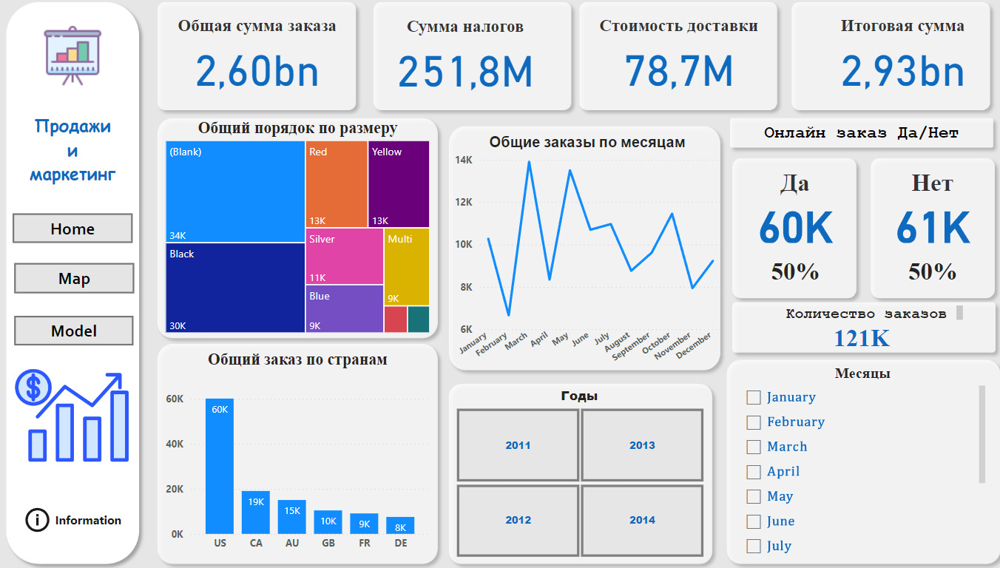

# Dashboard Power BI для велосипедной индустрии

## Общие данные
- **Общая сумма заказов**: 2,60 млрд
- **Сумма налогов**: 251,8 млн
- **Стоимость доставки**: 78,7 млн
- **Общая сумма**: 2,93 млрд

## Ежемесячные заказы
Dashboard отображает динамику заказов по месяцам с помощью графика "Ежемесячные общие заказы".

## Заказы по странам
Количество заказов из разных стран отражено в диаграмме "Общие заказы по странам".

## Заказы по цветам/брендам
Заказы по цветам/брендам велосипедов представлены в диаграмме "Размер общих заказов".

## Динамика по годам
Статистические данные за последние годы (2011, 2012, 2013, 2014) представлены в блоке "Годы".

## Онлайн-заказы
Dashboard также включает статистику онлайн-продаж:
- Количество онлайн-заказов: 60 тыс.
- Доля онлайн-заказов: 50%

Общее количество заказов составляет 121 тыс.

Этот dashboard включает все ключевые показатели, важные для велосипедной индустрии, и помогает пользователям лучше понимать состояние отрасли.

